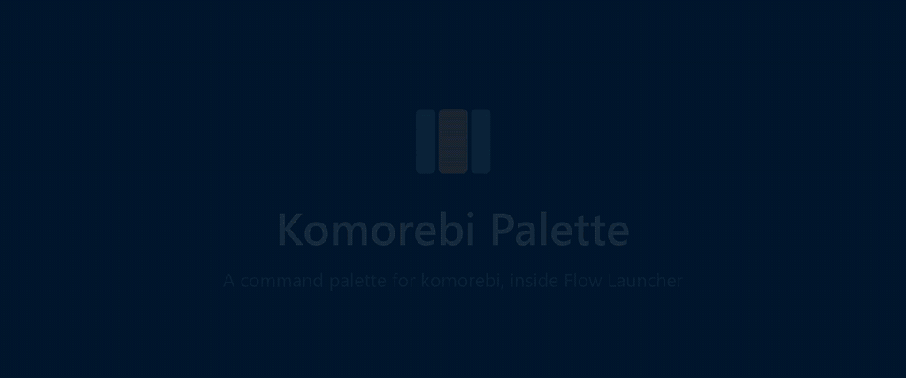
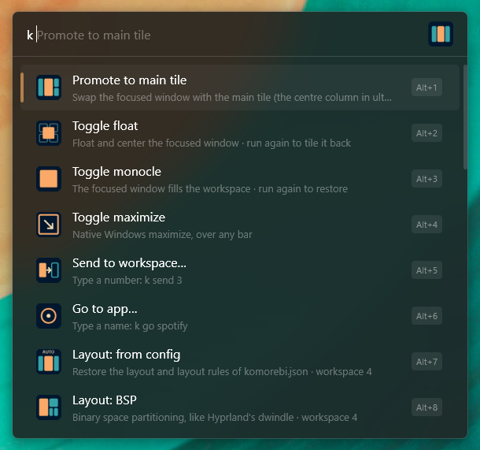
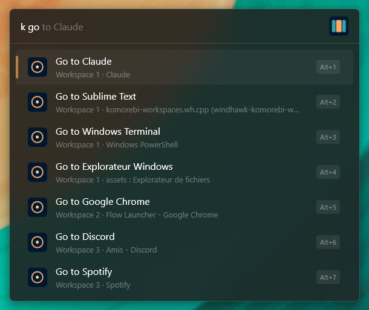
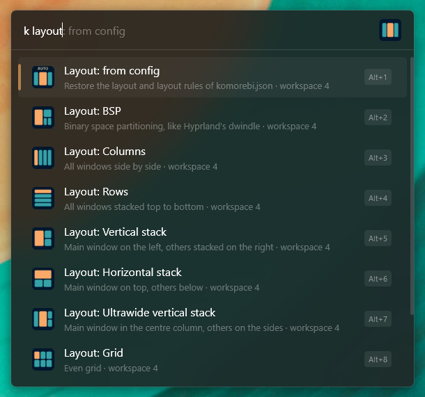
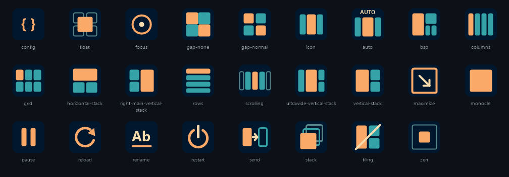

<p align="center">
  
</p>

<h1 align="center">Komorebi Palette</h1>

<p align="center">
  A command palette for the <a href="https://github.com/LGUG2Z/komorebi">komorebi</a> tiling window manager, right inside <a href="https://www.flowlauncher.com/">Flow Launcher</a>.
</p>

<p align="center">
  <a href="https://github.com/alexandrewavelet/Flow.Launcher.Plugin.KomorebiPalette/releases/latest"></a>
  <a href="LICENSE"></a>
  <a href="https://www.flowlauncher.com/"></a>
</p>

<p align="center">
  
</p>

<p align="center">
  ▶ <a href="assets/demo.mp4"><b>Watch the demo in full resolution</b></a> (MP4, 47 s)
</p>

Keyboard shortcuts are great for the things you do every minute. For everything else, there is the palette: type `k`, then what you want — `k grid`, `k send 3`, `k go spotify`, `k zen` — and press <kbd>Enter</kbd>. No more shortcuts to remember for the commands you only need once a day.

## Features

- **28 actions** covering windows, workspaces, layouts, gaps and komorebi itself.
- **Forgiving search** — prefixes (`k tog`), abbreviations (`k cntr`), typos (`k tilling`, `k cetner`) and accents all work.
- **Go to any app** on any workspace, by name.
- **Layouts that stick** — switching layout suspends the workspace's automatic layout rules, and `k from config` brings them back.
- **Reads your komorebi.json** — "Reset gaps" and "Layout: from config" restore *your* values, not hard-coded ones.
- **Recovers a stuck komorebi** — when komorebi stops answering, the palette says so and offers a one-click force restart that also brings back windows hidden on other workspaces.
- **Context menu** (<kbd>Shift</kbd>+<kbd>Enter</kbd>) to copy the underlying `komorebic` command or open its documentation.
- No dependencies besides Flow's own Python library.

## Requirements

- Windows with [komorebi](https://github.com/LGUG2Z/komorebi) installed and running (tested with komorebi 0.1.41).
- [Flow Launcher](https://www.flowlauncher.com/) (tested with 2.1.4). Flow installs Python for you if needed.

## Installation

From the Flow Launcher plugin store:

```
pm install Komorebi Palette
```

Or directly from the latest release:

```
pm install https://github.com/alexandrewavelet/Flow.Launcher.Plugin.KomorebiPalette/releases/latest/download/Flow.Launcher.Plugin.KomorebiPalette.zip
```

## Usage

The default action keyword is `k`. Type `k` and a space to browse every action.

<p align="center">
  
</p>

### Window

| Type | Action |
|---|---|
| `k center` | Swap the focused window with the main tile (the centre column in ultrawide layouts) |
| `k float` | Toggle float — floating windows are centred |
| `k monocle` | Toggle monocle (the window fills the workspace) |
| `k max` | Toggle native maximize |
| `k send 3` | Send the focused window to workspace 3, without following it |
| `k go spotify` | Focus an app, whatever workspace it is on — `k spotify` works too |

<p align="center">
  
</p>

### Workspace

| Type | Action |
|---|---|
| `k bsp`, `k columns`, `k grid`, `k scrolling`… | Change the layout of the focused workspace |
| `k from config` | Restore the layout and layout rules defined in komorebi.json |
| `k rename Web` | Rename the focused workspace |
| `k zen` | Large gaps to focus |
| `k no gaps` / `k reset gaps` | Remove the gaps / restore the komorebi.json values |
| `k tiling` | Toggle tiling on the focused workspace |
| `k stacking` | Toggle stacking new windows instead of splitting the space |

<p align="center">
  
</p>

### komorebi

| Type | Action |
|---|---|
| `k pause` | Pause or resume all tiling |
| `k reload` | Reload komorebi.json |
| `k restart` | Restart komorebi (and whkd / komorebi-bar, see settings) |
| `k force` | Force restart a komorebi that no longer responds |
| `k komorebi.json` / `k whkdrc` | Open a configuration file |

Renaming a workspace or changing its layout lasts until komorebi restarts; your komorebi.json is never modified.

## Settings

Open Flow's settings, then **Plugins › Komorebi Palette**.

| Setting | Default | Description |
|---|---|---|
| komorebic.exe | auto | Path to komorebic, if it is not on `PATH` or in `C:\Program Files\komorebi\bin` |
| komorebi.json | auto | Uses `%KOMOREBI_CONFIG_HOME%`, then `%USERPROFILE%` |
| whkdrc | auto | Uses `%WHKD_CONFIG_HOME%`, then `%USERPROFILE%\.config` |
| Editor for configuration files | Windows default | Editor used by `k komorebi.json` and `k whkdrc` |
| Restart whkd with komorebi | on | Adds `--whkd` to `komorebic start` / `stop` |
| Restart komorebi-bar with komorebi | off | Adds `--bar` to `komorebic start` / `stop` |
| Zen mode paddings | 80 / 15 px | Workspace and container padding used by `k zen` |
| Show open apps in search results | on | Lists matching windows next to the actions, without typing `go` |
| Action delay | 600 ms | Time given to Flow to close before an action runs |

## Troubleshooting

**"komorebi is not responding"** — komorebic cannot reach komorebi. Select the result to force a restart: it kills komorebi, restores the windows hidden on other workspaces, removes the stale socket and starts komorebi again.

**An action targets the wrong window** — raise *Action delay* in the settings. Actions wait for Flow to close and give the focus back before they run.

**A window is not affected** — komorebi cannot manage windows running as administrator (Task Manager, elevated terminals…) unless komorebi itself runs elevated.

Errors from komorebic are written to `komorebi-palette.log` in the plugin folder.

## Development

```
├── main.py               Entry point (Flow calls it with a JSON-RPC request)
├── plugin/
│   ├── palette.py        Plugin class: query, context menu, actions
│   ├── actions.py        Action catalogue
│   ├── komorebi.py       komorebic, window manager state, komorebi.json
│   ├── matching.py       Fuzzy matching
│   ├── executor.py       Runs actions in a detached process
│   ├── settings.py       SettingsTemplate.yaml values
│   └── clipboard.py      Win32 clipboard
├── tests/                unittest suite
├── scripts/make_icons.ps1
├── SettingsTemplate.yaml
└── plugin.json
```

Clone the repository into Flow's plugin folder (or link it there), then install the dependency:

```powershell
git clone https://github.com/alexandrewavelet/Flow.Launcher.Plugin.KomorebiPalette
New-Item -ItemType Junction -Path "$env:APPDATA\FlowLauncher\Plugins\KomorebiPalette" -Target .\Flow.Launcher.Plugin.KomorebiPalette
pip install -r requirements.txt -t lib
```

Run the tests:

```powershell
python -m unittest discover -s tests -t .
```

Changes to Python files apply on the next query; changes to `plugin.json` or `SettingsTemplate.yaml` need a Flow restart.

The icons are drawn by `scripts/make_icons.ps1` with the [Retro 82](https://github.com/OldJobobo/omarchy-retro-82-theme) palette:

<p align="center">
  
</p>

### Releasing

Bump `Version` in `plugin.json`, add an entry to `CHANGELOG.md` and push to `main`. The *Publish Release* workflow runs the tests, bundles the dependencies into `lib/` and publishes `Flow.Launcher.Plugin.KomorebiPalette.zip` as release `v<version>`. The Flow plugin store picks up new releases automatically.

## Credits

[komorebi](https://github.com/LGUG2Z/komorebi) is made by [LGUG2Z](https://github.com/LGUG2Z) and licensed separately. This plugin is an independent project, not affiliated with komorebi.

## License

[MIT](LICENSE)
